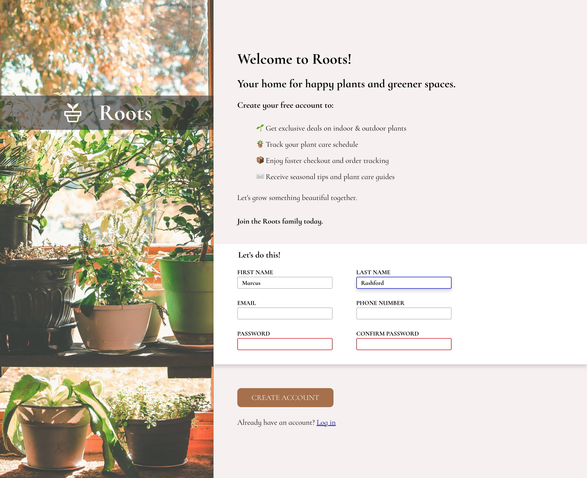

# Sign-Up Form

A responsive sign-up form project created as part of **The Odin Project** curriculum.

## Project Overview

This project demonstrates HTML form creation and CSS styling techniques, focusing on:
- Form layout and design
- CSS Flexbox for responsive layouts
- Form validation styling
- Background image implementation
- Typography and visual hierarchy

## Screenshot



## Features

- **Two-column layout** with background image on the left and form on the right
- **Plant-themed design** with elegant typography using "Cormorant Infant" serif font
- **Form validation** with visual feedback for invalid inputs
- **Responsive background** that scales properly with content height
- **Clean, modern styling** with subtle shadows and rounded corners

## Technologies Used

- HTML5
- CSS3 (Flexbox)
- Google Fonts (Cormorant Infant)

## File Structure

```
sign-up-form/
├── index.html          # Main HTML file
├── style.css           # Main stylesheet
├── reset.css           # CSS reset
├── plant.jpg           # Background image
├── plant.svg           # SVG image for the logo
└── README.md           # Project documentation
```

## How to Run

1. Clone or download this repository
2. Open `index.html` in your web browser
3. No additional setup or dependencies required

## Learning Objectives

This project helped practice:
- Creating accessible HTML forms
- Advanced CSS layout techniques
- Form styling and user experience
- Background image positioning
- Flexbox for responsive design

## Image Credits

Background image: [Green plants in assorted color pots near brown wooden door](https://unsplash.com/photos/green-plants-in-assorted-color-pots-near-brown-wooden-door-r9KNqX6FkKc) by Nong from Unsplash.

Plant SVG icon: [Potted Plant](https://fonts.google.com/icons?selected=Material+Symbols+Outlined:potted_plant:FILL@0;wght@400;GRAD@0;opsz@24&icon.query=plant&icon.size=24&icon.color=%23FFFFFF&icon.platform=web) from Google Fonts Icons.

## The Odin Project

This project is part of [The Odin Project](https://www.theodinproject.com/) - an open-source curriculum for learning web development.